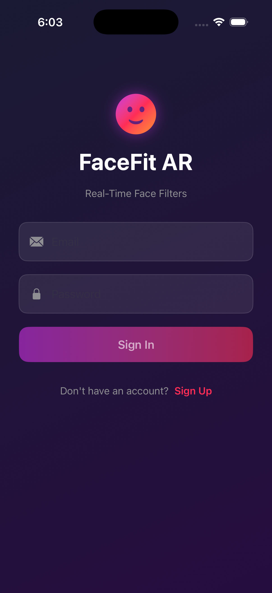

# FaceFit AR

FaceFit AR is a native iOS application that applies real-time face filters using the device camera. The application detects faces and overlays visual elements such as ears, glasses, crowns, and masks on the detected face in real time.

The project is built using Swift and follows a modular architecture to keep the code organized and maintainable.

---

# Features

• Real-time face detection using the device camera
• Augmented reality face filters (ears, glasses, crown, mask)
• Interactive filter selection interface
• Live face detection status indicator
• Modular project structure for better code organization

---

# Project Structure

The project follows a modular structure inspired by the MVVM architecture.

```
FaceFit
│
├── Models
│   ├── FaceLandmarks.swift
│   ├── FilterOption.swift
│   └── User.swift
│
├── Services
│   ├── CameraService.swift
│   ├── FaceDetectionService.swift
│   ├── FilterRenderer.swift
│   └── AuthService.swift
│
├── ViewModels
│   ├── CameraViewModel.swift
│   └── AuthViewModel.swift
│
├── Views
│   ├── CameraView.swift
│   ├── CameraPreviewView.swift
│   ├── FilterSelectorView.swift
│   ├── LoginView.swift
│   └── SignUpView.swift
│
├── Assets.xcassets
├── FaceFitApp.swift
└── ContentView.swift
```

---

# Technologies Used

• Swift
• SwiftUI
• AVFoundation (camera capture)
• Vision Framework (face detection)
• Xcode

---

# Installation

1. Clone the repository

```
git clone https://github.com/Pranav-player/FaceFit.git
```

2. Open the project in Xcode

```
FaceFit.xcodeproj
```

3. Run the application on a real iOS device.

---

# How It Works

1. The camera captures live video frames.
2. The Vision framework detects faces from each frame.
3. Facial landmarks are used to determine where filters should be placed.
4. The selected filter is rendered on top of the detected face.

---
## Screenshots

### Login Screen


